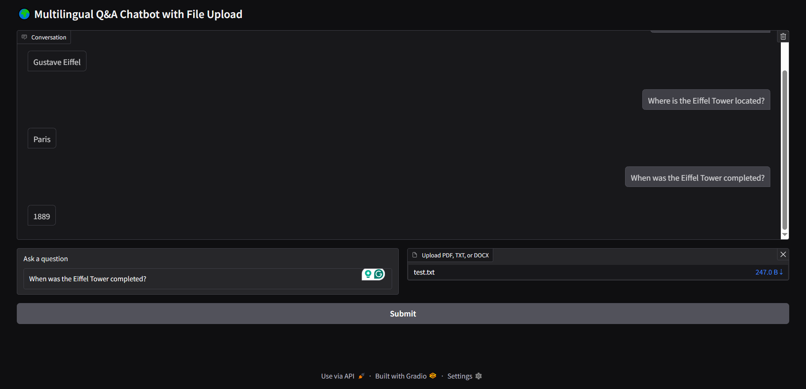

# Multilingual Q&A Chatbot with File Upload and Memory

[](https://opensource.org/licenses/MIT)
[](https://www.python.org/downloads/)
[](https://huggingface.co/spaces/ozlemelo/multilingual-qa-chatbot)

A conversational chatbot built with Gradio and Hugging Face Transformers that supports multilingual question answering (English, Turkish, French, etc.).  
Users can upload PDF, TXT, or DOCX documents and ask questions based on the content.  
The chatbot also maintains conversation history for multi-turn dialogues.

---

## 🚀 Features

- Multilingual question answering using `mrm8488/bert-multi-cased-finetuned-xquadv1` model
- File upload support for `.pdf`, `.txt`, and `.docx` formats
- Persistent chat history to remember previous conversation turns
- Built with Gradio for an interactive web interface
- Supports multiple languages (English, Turkish, French, and more)

---

## 🧪 Live Demo

You can try the chatbot live on Hugging Face Spaces:

👉 [**Hugging Face Space: multilingual-qa-chatbot**](https://huggingface.co/spaces/ozlemelo/multilingual-qa-chatbot)

---

## 📁 Folder Structure

```plaintext
multilingual-qa-chatbot/
├── app.py                 # Main Gradio application script
├── requirements.txt       # Python dependencies
├── README.md              # Project documentation
├── .gitignore             # Git ignore file
└── assets/                # Optional assets like images or icons
    ├── first_test.png     # First demo screenshot
    └── languages.png      # Supported languages visual
```

---

## ⚙️ Installation

1. Clone the repository:

   ```bash
   git clone https://github.com/ozlemelo/multilingual-qa-chatbot.git
   cd multilingual-qa-chatbot
   ```

2. Create and activate a virtual environment (optional but recommended):

   ```bash
   python -m venv venv
   source venv/bin/activate   # Linux/Mac
   venv\Scripts\activate    # Windows
   ```

3. Install the dependencies:

   ```bash
   pip install -r requirements.txt
   ```

---

## 🚀 Running the app

Run the chatbot locally with:

```bash
python app.py
```

Then open the displayed local URL in your browser to start interacting.

---

## 📄 Usage

- Upload a `.pdf`, `.txt`, or `.docx` file containing the context you want to ask questions about.
- Enter your question in the input box.
- Press Submit and the chatbot will reply based on the uploaded document.
- Chat history is maintained during the session.

---

## 📸 Screenshots

Here is a screenshot of the chatbot in action:



---

## 🛠️ Dependencies

- `transformers`
- `gradio`
- `PyPDF2`
- `python-docx`

---

## 🚧 What Could Be Improved

- Switch to a more powerful model like `distilbert`, `mbart`, or OpenAI-compatible LLMs
- Add more advanced multi-turn memory (e.g., using vector stores)
- Add support for audio input/output (speech-to-text and text-to-speech)
- Dockerize for production use
- Deploy on other platforms like Streamlit, FastAPI, or Flask

---

## 🤝 Contributing

Feel free to open issues or pull requests to improve the project.

---

## 📄 License

This project is licensed under the [MIT License](https://opensource.org/licenses/MIT).

---

## 🙋‍♀️ Author

[Özlem Ekici](https://www.linkedin.com/in/ozlemekici/)

